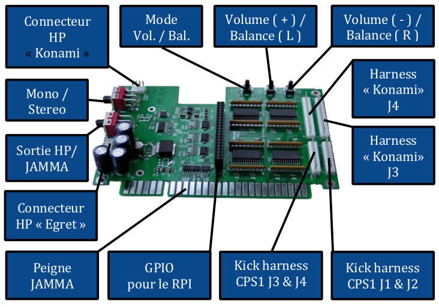

## Présentation

Le RPI2JAMMA est une carte permettant de connecter un Raspberry Pi (RPi) sur une borne d'arcade JAMMA et ainsi profiter de l'émulation de plusieurs systèmes (console et arcade).

Cette carte a été créée, fabriquée et distribuée par « aje_fr ». Elle se destine à un usage de loisir privé et n’est en aucun cas destinée à une utilisation en exploitation commerciale ou à un commerce de revente.

## Spécifications

* Le RPi est alimenté par le port JAMMA
* Sortie RVB 18 bits, 15khz, 24khz (les menus sont en 15khz et si un jeu 24khz est lancé, le système bascule en 24khz)
* Affichage horizontal (yoko) ou vertical (tate)
* "Pixel Perfect", chaque jeu utilise sa propre modeline donc résolution et fréquence de rafraîchissement respectées
* Pas de tearing !
* Ampli stéréo intégré
* Interrupteur pour le choix Mono / Stéreo
* Interrupteur pour le choix de la sortie HP ou sur JAMMA
* Connecteurs pour HP externes 4 points (format Konami) ou 6 points (Egret 3 par ex.)
* Réglage numérique du volume et balance par bouton. Une led indique le mode (balance ou volume). Volume accessible également via un raccourci (voir "Contrôles")
* Jusqu'à 4 joueurs !
* Kick harness au format CPS1 pour les boutons 4, 5, 6 des 4 joueurs (les boutons 4 et 5 des joueurs 1 et 2 aussi disponibles sur le peigne JAMMA)
* Connecteurs 15 points (format Konami) pour joueurs 3 et 4
* Optimisé pour RPi3b+, RPi3 et RPi2.

## Schéma de présentation

## Images



## Les différents connecteurs

IMAGE

## Matériel nécessaire

* Une carte RPI2JAMMA
* Un RPi (RPi3b+ ou RPi3 conseillé pour de bonnes performances)
* Une carte MicroSD de 4Go minimum (classe 10 de préférence)
* Une clé USB (bon débit en USB2 conseillé)
* Un ordinateur (Windows / OSX / Linux)
* Un multimètre (fortement conseillé)

## Installation logicielle

### Système (MicroSD)

* Téléchargez l'image de la distribution depuis le lien fourni par aje_fr
* Décompressez l'archive pour extraire l'image (fichier .img)
* Téléchargez "Etcher" (Windows, OSX et Linux) disponible ici ou “Win32diskimager” disponible ici
* Flashez l'image sur la carte MicroSD avec "Etcher" ou “Win32diskimager”

### Stockage (Clé USB)

Formatez la clé USB en FAT32 de préférence (voir ci-dessous), en exFat ou NTFS. Les autres systèmes de fichier ne sont pas supportés.

#### Windows
Pour les clés USB de capacité inférieure ou égale à 32 Go un simple clic-droit sur le lecteur concerné permettra de formater la clé en FAT32. Pour les clés USB de capacité supérieure à 32 Go il faudra utiliser "fat32format" ou un logiciel équivalent.

#### OSX
Quelle que soit la capacité de la clé USB, l'utilitaire de disque natif permet de la formater en FAT32. Il faut utiliser l'onglet "Partition" et bien choisir "Master Boot Record" lorsque l'assistant le propose.

#### Linux
Quelle que soit la capacité de la clé USB, l'utilitaire "gparted" permet de la formater en FAT32.

Vos périphériques de stockage (MicroSD et clé USB) sont prêts à être installés, vous pouvez passer à l'étape suivante.


## Installation matérielle

* Insérez la carte MicroSD dans le RPi
* Insérez la clé USB dans un des ports USB du RPi
* Couplez le RPi à la carte RPI2JAMMA via les connecteurs GPIO respectifs. Le port MicroSD du RPi doit être orienté vers le port JAMMA. Veillez à bien aligner les broches et donc à ne pas les décaler.

Votre RPI2JAMMA est maintenant prêt à l'utilisation, bien sûr vous pouvez l'installer correctement sur un support (planche en bois, plexiglas etc.) avec des pieds de PCB.

## Prise en main

### Prérequis
Votre borne doit être conforme au standard JAMMA (non modifié de manière exotique). La tension délivrée par le peigne JAMMA (entre les pin 1 & 3 ou 1 & 4) doit être située entre 5v et 5,25v maximum.
Si vous ne passez pas le son par le JAMMA, connectez les HP de votre borne sur le connecteur « Konami » ou « Egret ».
Si vous utilisez plus de 3 boutons, connectez les "Kick Harness" (format CPS1).
Si votre borne est 3 ou 4 joueurs, connectez les J3 & J4 (plus les "Kick Harness" si plus de 3 boutons).

### Mise en route
* Branchez le RPI2JAMMA sur le port JAMMA de votre borne
* Sélectionnez la sortie son HP ou JAMMA avec l’interrupteur
* Sélectionnez le son Mono ou Stéréo avec l’interrupteur. Normalement en Mono si par le peigne JAMMA (sauf si câblé MVS)
* Allumez la borne
* Le RPI2JAMMA démarre et créé les répertoires nécessaires sur la clé USB
* Le menu principal doit s'afficher, si ce n'est pas le cas reportez-vous à la section "Dépannage"
* Sélectionnez "Settings" puis "01_Shutdown" et attendez quelques secondes avant d'éteindre la borne.
* Récupérez la clé USB et installez des ROMs dans les répertoires adéquats (snes, nes, neogeo etc.). Pour les émulateurs de jeux d'arcade les versions de "romset" sont précisées dans la FAQ ou dans le fichier “__Emulators_version__.txt” du répertoire “Config_RPI2XXXXX”. 
* Rebranchez la clé USB dans le RPi et rallumez votre borne
* Borne allumée, vérifiez à nouveau la tension de 5v

### Extinction
* Quitter le jeu en cours
* Revenir au menu principal (accueil)
* Sélectionner « Settings »
* Sélectionner « Shutdown »
* Attendre quelques secondes
* Éteindre la borne.

## Menu principal
| Menu | Description |
|------|-------------|
| 01_Shutdown | Éteindre le RPI2JAMMA |
| 02_Restart System | Redémarrer le RPI2JAMMA |
| 03_Screen | <p>**AdvanceMAME Config**<br>Configurer la sortie vidéo de l'émulateur AdvanceMAME<br>**Display test**<br>Afficher des mires de test.<br>**Switch to Horizontal**<br>Basculer vers l'affichage horizontal (Yoko)<br>**Switch to Vertical**<br>Basculer vers l'affichage vertical (Tate)<br>**Switch to Vertical (inversed)**<br>Basculer vers l'affichage vertical (Tate) inversé</p> |
| 04_Tools | <p>**Clear Game Database**<br>Effacer la base de donnée des jeux<br>**Install Update Patch**<br>Permet d’installer un patch de mise à jour (si disponible)<br>**Scrap All Roms**<br>"Scrapper" toutes les ROMs<br>**erify USB Key**<br>Vérifier et corriger les éventuelles erreurs du système de fichier de la clé USB</p> |
| 05_NeoGeo | <p>**Switch to AES mode**<br>Basculer l'émulateur Neo Geo en mode AES (console)<br>**Switch to MVS mode**<br>Basculer l'émulateur Neo Geo en mode MVS (arcade)</p> |
| 06_Amiga | <p>**Scan for Roms**<br>Permet de scanner les ROMs amiga et créer les fichiers de configuration adéquats (jeux multi-disques par exemple)</p> |
| 07_Extras | <p>**01_MalditaCastilla**<br>Lancer le jeu MalditaCastilla<br>**02_SuperCrateBox**<br>Lancer le jeu SuperCrateBox</p> |
| 08_WIFI | <p>**Disable**<br>Désactiver la fonction Wi-Fi du RPI2JAMMA<br>**Enable**<br>Activer la fonction Wi-Fi du RPI2JAMMA<p> |
| 09_Info | <p>Affiche la version courante des émulateurs et des romsets</p> |

## Contrôles
### RPI2JAMMA
#### Légende
| Menu                 | Description                     |
|----------------------|---------------------------------|
| Player 1 / 2 / 3 / 4 | P1 / P2 / P3 / P4               |
| Bouton 1 / 2 / 3 / 4 | B1 / B2 / B3 / B4               |
| Start (0,5s)         | Appui long Start (0,5s minimum) |

#### Dans les menus
| Menu                  | Description |
|-----------------------|-------------|
| Valider               | B1          |
| Retour                | B2          |
| Options (sur un jeu)  | B4          |
| Menu EmulationStation | Start       |

#### En jeu
| Menu                   | Description                    |
|------------------------|--------------------------------|
| Quitter                | Start (0,5s) + B2              |
| Créditer               | Start (0,5s) + B1              |
| Pause                  | Start (0,5s) + Bas             |
| Volume - / +           | Start (0,5s) + Gauche / Droite |
| Options émulateur      | Start P1 (5s)                  |
| Test mode              | Start P2 (5s)                  |
| Menu UniBios (Neo Geo) | Start P1 (0,5s) + B1 + B2 + B3 |

#### Émulation Amstrad
| Menu           | Description |
|----------------|-------------|
| Touche "Enter" | Start       |
| Barre d'espace | B4          |
| Touche "Y"     | B5          |
| Touche "N"     | B6          |
| Option         | Start (5s)  |

#### Émulation Atari
| Menu           | Description |          |
|----------------|-------------|----------|
|                | Player 1    | Player 2 |
| Fire           | B1          | B1       |
| Barre d'espace | B2          |          |
| Touche "F1"    | B3          |          |
| Touche "F2"    |             | B3       |
| Touche "T"     | B4          |          |
| Touche "Y"     | B5          |          |
| Touche "N"     | B6          |          |
| Touche "1"     | Start       |          |
| Touche "2"     |             | Start    |

#### Émulateurs arcades
Le bouton de service et le monnayeur de la borne ont leurs fonctions normales.

## Options avancées
### Réseau
#### Ethernet
Connectez un câble RJ45 entre le RPi et votre box Internet, celle-ci attribuera automatiquement une adresse IP au RPI2JAMMA (via le protocole DHCP).
#### WiFi
Éditez le fichier wifi_config.txt dans le dossier Config_RPI2XXXXX qui se trouve à la racine de la clé USB puis modifiez les deux lignes suivantes :
```
psk="la_clé_de_votre_réseau_wifi"
ssid="le_nom_de_votre_réseau_wifi"
```
Sous Windows il faut convertir le fichier en format Unix à l'aide de Notepad++ (Edition > Convertir les sauts de ligne > Convertir en format Unix)
Puis activez le wifi dans le menu principal : 08_WIFI.

### Ajout de roms
#### Via le réseau
Depuis votre ordinateur, saisissez \\RPI2JAMMA\UsbKey\roms dans l'explorateur Windows. Ajoutez des ROMs dans le dossier correspondant à l'émulateur de votre choix puis redémarrez le RPI2JAMMA afin de mettre à jour la liste des ROMs.

#### Via la clé USB
Éteignez le RPI2JAMMA puis débranchez la clé USB. Branchez-là sur votre ordinateur puis ajoutez des ROMs dans le dossier correspondant à l'émulateur de votre choix. Débranchez proprement la clé USB de votre ordinateur puis branchez-là sur le RPI2JAMMA, pour finir démarrez le RPI2JAMMA.

### BIOS Neo Geo
Le pack Neo Geo proposé sur le forum Neo-Arcadia fournit les différents BIOS (dans le répertoire "BIOS") et propose par défaut un BIOS de type "unibios".
Si vous souhaitez en utiliser un autre, renommez simplement le fichier du BIOS choisi en "neogeo.zip" et prenez soin au préalable de renommer le fichier correspondant au bios actuel pour ne pas le perdre (ex : neogeo_UNIBIOS.zip).

### Autoboot
L'autoboot permet de lancer un jeu automatiquement au démarrage du RPI2JAMMA. Modifiez le fichier autoboot.txt dans le dossier Config_RPI2XXXXX qui se trouve à la racine de la clé USB.
Le fichier doit contenir les deux lignes suivantes :
```
system=nom_du_système (nom du dossier)
game=nom_du_jeu (avec extension)
```
Exemple avec le jeu Metal Slug sur Neo Geo :
```
system=neogeo
game=mslug.zip
```
Sous Windows il faut convertir le fichier en format Unix à l'aide de Notepad++ (Edition > Convertir les sauts de ligne > Convertir en format Unix).

### RetroAchievements
Les retroachievements sont des succès/trophées à débloquer en jeu en réalisant certaines actions. Ce système est connu sur les consoles de nouvelle génération et grâce à la plateforme https://retroachievements.org il est possible de faire la même chose avec les jeux "rétro".

Prérequis :

* Créer un compte sur le site https://retroachievements.org
* Connecter votre RPI2XXXXX à internet

Modifiez le fichier RetroAchievements.txt dans le dossier Config_RPI2XXXXX qui se trouve à la racine de la clé USB.
Le fichier doit contenir les lignes suivantes :
```
cheevos_enable = "false"
cheevos_test_unofficial = "false"
cheevos_hardcore_mode_enable = "false"
cheevos_username = ""
cheevos_password = ""
```
Sous Windows il faut convertir le fichier en format Unix à l'aide de Notepad++ (Edition > Convertir les sauts de ligne > Convertir en format Unix).

| Option                       | Description                                                           |
|------------------------------|-----------------------------------------------------------------------|
| cheevo_enable                | ```"true|false"``` Activer/Désactiver la fonction retroachievements.  |
| cheevos_test_unofficial      | ```"true|false"``` Activer/Désactiver les retroachievements non officiels. Ces derniers ne rapportent aucun point. Cette fonction existe à des fins de test et est plutôt réservée à ceux qui développent les retroachievements.                                                                                     |
| cheevos_hardcore_mode_enable | ```"true|false"``` Activer/Désactiver le mode Hardcore. Lorsqu'il est actif toutes les fonctions comme le ralenti, les codes de triche et les savestates sont désactivées. L'expérience de jeu est alors identique au système original et l'avantage est que vos points sont doublés.                                     |
| cheevos_username             | Saisir votre nom d'utilisateur.                                       |
| cheevos_password             | Saisir votre mot de passe.                                            |

### Header Interactif (option en développement)
Le RPI2JAMMA offre la possibilité d'avoir un "header" intéractif en connectant un écran additionel à l'aide d'un adaptateur "USB vers DVI" ou "USB vers VGA" compatible avec la norme __"DisplayLink"__. Les médias affichés seront ceux des jeux contenus sur la clé USB.

### Jouer à un jeu vertical sur un écran horizontal
Commentez la modeline correspondante dans le fichier "modeline.txt" situé dans le répertoire du système concerné. Commenter signifie simplement ajouter un # en début de ligne, exemple :
```
# mslug.zip;modeline "320x224_59.185606" 6.136900 [...]
```

### Lecteur vidéo
Un lecteur vidéo existe (.avi .AVI .mkv .MKV), il suffit de mettre des vidéos dans le répertoire __Videos__ situé à la racine de la clé USB.

### Changer le thème du menu
Depuis le menu EmulationStation, allez dans "UI Settings > Theme Set" puis choisissez le thème (voir tableau ci-dessous).

| Thème               | Description                                                                 |
|---------------------|-----------------------------------------------------------------------------|
| ES-THEME-CLEAN-LOOK | Thème de base EmulationStation (inutile ici)                                |
| RPI2X_TATE          | Previews image 1:1 (extrait d’image "PixelPerfect") pour écran vertical.    |
| RPI2X_TATE43        | Previews vidéo image complète 4:3 pour écran vertical.                      |
| RPI2X_YOKO          | Previews image 1:1 (extrait d’image "PixelPerfect" ) pour écran horizontal. |
| RPI2X_YOKO43        | Previews vidéo ou image complète 4:3 pour écran horizontal.                 |

Pour afficher les images correspondantes à la place des vidéos, renommer le dossier __video__ avec un autre nom.

### Activer le mode kiosq ou kid
Depuis le menu EmulationStation, allez dans "UI Settings > UI MODE" 

| Option | Description                                                    |
|--------|----------------------------------------------------------------|
| kiosq  | Menu EmulationStation bloqué, édition des favoris disponible   |
| kid    | Menu EmulationStation bloqué, édition des favoris indisponible |

Pour débloquer l'accès au menu EmulationStation, faire le Konami Code dans le menu.

### Fonctionnement des médias
Dans chaque répertoire dédié à un émulateur il y a quatre répertoires :

* __videos__       : previews vidéo (compatible avec les thèmes RPI2X_YOKO43 et RPI2X_TATE43)
* __images_full__  : previews images 4:3 (compatible avec les thèmes RPI2X_YOKO43 et RPI2X_TATE43)
* __images_pixel__ : previews images 1:1 (compatible avec les thèmes RPI2X_YOKO et RPI2X_TATE)
* **_old_medias**  : anciens médias previews (compatible avec la version logicielle B11 et inférieure)

Il y a également un fichier ```gamelist.xml``` qui indexe les médias associés aux ROMs. L'indexation est renseignée de la manière suivante :
```
<game>
<name>Nom du jeu</name>
<path>Chemin d'accès de la rom</path>
<image>chemin d'accès de l'image 1:1</image>
<marquee>chemin d'accès de l'image 4:3</marquee>
<video>chemin d'accès de la video preview</video>
<desc>description (éditeur / année / nbr joueurs</desc>
<screen>résolution</screen>
<orientation>yoko/tate</orientation>
</game>
```

Lorsqu'on utilise le thème RPI2X_YOKO43 ou RPI2X_TATE43, si le dossier "videos" existe il sera prioritaire : les vidéos présentes à l'intérieur et indiquées entre les balises ```<video></video>``` seront donc affichées en preview.

Si le dossier "videos" n'existe pas ou s'il a été renommé : les images présentes dans le dossier "images_full" et indiquées entre les balises ```<marquee></marquee>``` seront affichées en preview. En résumé, les balises ```<image></image>``` ne sont pas utilisées avec les thèmes RPI2X_YOKO43 et RPI2X_TATE43.

Lorsqu'on utilise le thème RPI2X_YOKO ou RPI2X_TATE seules les images présentes dans le dossier "images_pixel" et indiquées entre les balises ```<image></image>``` seront utilisées. En résumé, il n'y a pas de preview vidéo avec les thèmes RPI2X_YOKO ou RPI2X_TATE.

## Dépannages

__Pas d'image alors que le RPi est allumé (diode active et fixe)__<br>
L’image SD est mal enregistrée, veuillez recommencer la procédure ou essayer avec une autre carte SD.

__Pas d'image alors que le RPi est allumé (diode active et clignotante au démarrage)__<br>
Vérifiez le branchement de la clé USB, s’il n’y a pas de clé la distribution ne démarre pas.

__L'émulation de jeux NEOGEO ne fonctionne pas__<br>
Dans la clé USB, vérifiez la présence du BIOS Neo Geo dans le dossier "neogeo".

__L'émulation de jeux PGM ne fonctionne pas__<br>
Dans la clé USB, vérifiez la présence du BIOS PGM dans le dossier de l'émulateur concerné.

__Impossible d'accéder au menu EmulationStation__<br>
Le mode kiosq ou kid a dû être activé et masque les menus configuration. Pour débloquer l’accès faites le Konami Code dans le menu principal.

__Si votre problème n’est pas évoqué ici__ vous pouvez venir échanger à ce sujet, avec le sourire, sur le forum de Neo-Arcadia.

## FAQ
__Une adresse pour télécharger les bonnes roms ?__
Non. Cependant sur le forum Neo-Arcadia, la « RPI-Team » mets à disposition des packs de médias triés pour le RPI2JAMMA.

__Quel modèle de RPi est le plus adapté ?__
Le RPi 3b ou RPi 3b+, le deuxième ayant plus de puissance il s’avère être le meilleur choix.
Bien que nous y travaillons d'arrache-pied, le RPi 4 n'est pas supporté pour le moment à cause de problèmes techniques bloquants.

__Peut-on jouer sur un écran Vertical (tate) ?__
Oui. Le RPI2JAMMA peut adapter son affichage à un écran horizontal ou vertical, l'option est accessible dans le menu principal.

__Quelle différence entre Mame, FBA et AdvanceMame ?__
Les trois émulent des systèmes arcade mais certains jeux passent mieux sur l’un ou l’autre. Globalement les jeux les plus anciens sur MAME, les plus récents sur FBA ou AdvanceMame.

__Quelles sont les versions des émulateurs arcade et des romset ?__
A l’heure actuelle (04/2020) :
MAME 2010 = set MAME 0.139
MAME 2003 = set MAME 0.78
FBA = set FBA v0.2.97.42
FBA 2012 = set FBA v0.2.97.30
AdvanceMame 3.6 = set MAME 0.106

__Le RPI2JAMMA est-il compatible avec un écran 31khz ?__
Non, il existe pour cela le RPI2NUC.

__Peut-on modifier l’affichage ou les commandes d’un jeu ?__
Oui, Start (5s) en jeu permet d’accéder à un menu de réglage avec plein d’options. Notez que ce menu n'est pas disponible pour tous les émulateurs.
